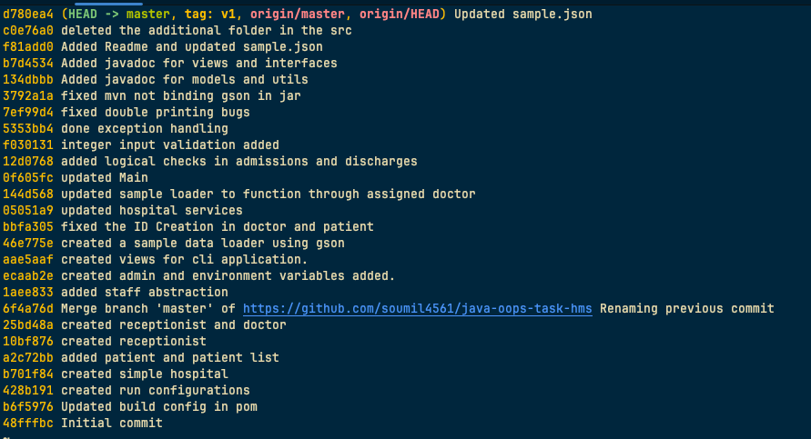

# Hospital Management System
A java-based application designed to manage hospital operations efficiently. It allows administrators to manage staff, doctors to handle patient admissions and discharges, and receptionists to register and assign patients. The project is made following the OOPs principles


## Features
- Command line application
- Follows OOPS principles

### Admin Features
- Update hospital details (name, address).
- Add doctors and receptionists to the system.

### Doctor Features
- Admit patients.
- Discharge patients.
- View assigned patients.

### Receptionist Features
- Register new patients.
- Assign patients to doctors.

## Git Logs


## OOPs Concepts
### Abstraction
- Defined interfaces for different roles (Admin, Doctor, Receptionist) to enforce role-specific actions.

### Encapsulation
- By using private fields and getter-setters, access to critical fields was controlled
- Using private constructors in the singleton classes to limit multi-instance creation

### Inheritence
- Created Staff abstract class inherited by all staff roles in the hosptial, namely Admin, Receptionist and Doctor

### Polymorphism
- Implemented method overriding to allow specific behaviors for different staff roles.

## Documentation

Documentation is done in code via the JavaDoc principles.
## Run Locally
Be sure to setup both java and maven in your system before proceeding.
### Create your own jar

```bash
  git clone https://github.com/soumil4561/java-oops-task-hms.git
```

Go to the project directory

```bash
  cd java-oops-task-hms
```

Resolve the maven dependicies

```bash
  mvn dependency:resolve
```

Create the jar

```bash
  mvn package
```
Run the jar

```bash
    java -jar ./target/<name of jar>.jar
```

### Download the release and Run
Download the jar from the releases. Open the folder where you downloaded the jar in terminal

```bash
    java -jar <name of jar>.jar
```


## Installation
Once the project is cloned
```bash
  mvn install
```
    
